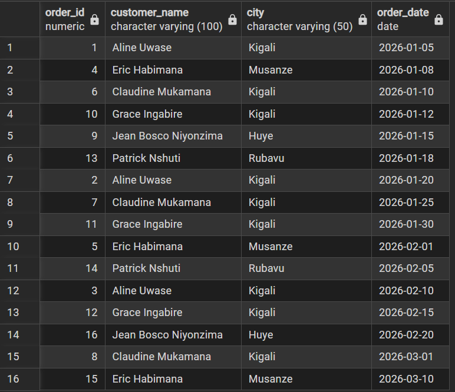
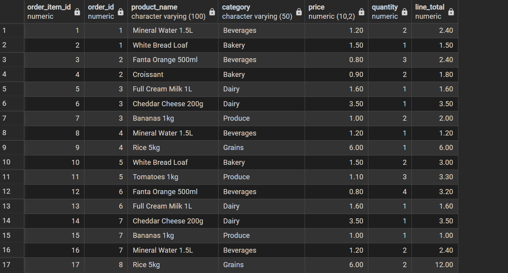
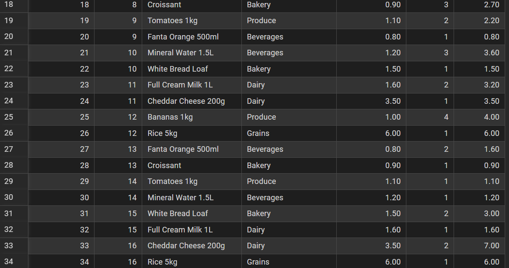
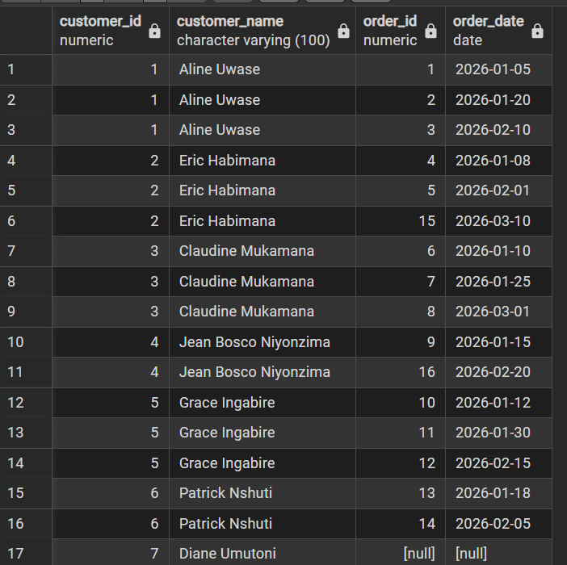
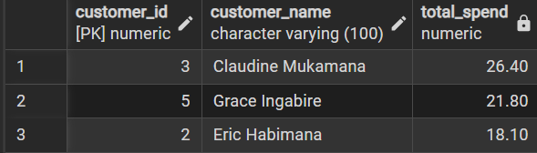
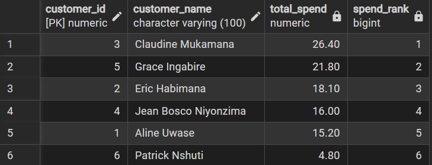
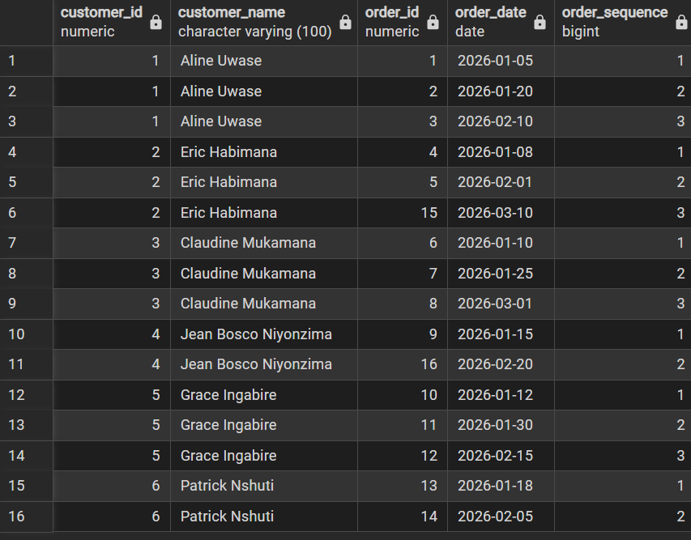
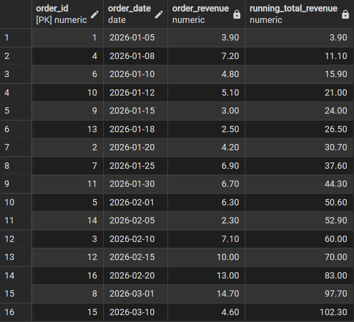
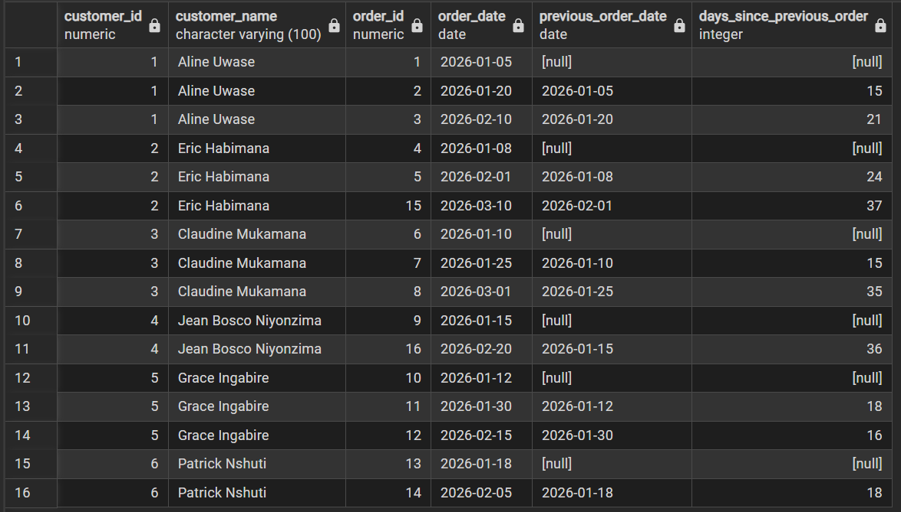

# PLSQL Assignment One — Sunrise Supermarket

**Name:** NDAGIJIMANA RASANA Bonte
**Student ID:** 29506
**Course:**PL/SQL
**Group:**C
**DBMS used:** PostgreSQL 16

---

## 1. Summary

This project models a small supermarket's sales data — customers, products,
orders, and the individual items within each order — and answers a set of
management questions about who the customers are, what they buy, and how
sales trend over time. It includes the schema, sample data (7 customers, 9
products across 4 categories, 16 orders, 34 order items), and 7 queries
covering inner/left joins, a CTE, and four window-function analyses.

## 2. Business Scenario

Sunrise Supermarket sells products to customers, who place orders containing
one or more items. Management wants three things:

1. **Who their customers are** — where they're based and how often they buy.
2. **What they buy** — which products and categories drive orders.
3. **How sales are trending over time** — revenue growth, order frequency,
   and customer loyalty patterns.

The schema below supports all three: `customers` and `orders` capture *who*,
`order_items` and `products` capture *what*, and `order_date` throughout
supports the *when*.

## 3. How to Run It

1. Install PostgreSQL (or adapt the syntax for your preferred DBMS — see
   notes in Section 6).
2. Create a database: `createdb sunrise_supermarket`
3. Load the schema: `psql -d sunrise_supermarket -f schema.sql`
4. Load the sample data: `psql -d sunrise_supermarket -f data.sql`
5. Run the queries: `psql -d sunrise_supermarket -f queries.sql`
   or copy individual queries from `queries.sql` into your SQL client.

```
git clone <this repo>
cd assignment_1_rasana-29506
createdb sunrise_supermarket
psql -d sunrise_supermarket -f schema.sql
psql -d sunrise_supermarket -f data.sql
psql -d sunrise_supermarket -f queries.sql
```

## 4. Schema

| Table | Purpose |
|---|---|
| `customers` | Customer identity and location |
| `products` | Product catalog with category and price |
| `orders` | One row per order, linked to a customer |
| `order_items` | Line items within an order (product + quantity) |

Full DDL is in [`schema.sql`](schema.sql).

## 5. Sample Data

- **7 customers** across Kigali, Musanze, Huye, and Rubavu (one customer,
  Diane Umutoni, has no orders yet — included deliberately to test the LEFT
  JOIN).
- **9 products** across 4 categories: Beverages, Bakery, Dairy, Produce,
  Grains (4 categories, exceeding the 3-category minimum).
- **16 orders** dated across January–March 2026.
- **34 order items** distributed across those orders.

Full data is in [`data.sql`](data.sql).

---

## 6. Queries, Results, and Interpretation

All queries were run against a live PostgreSQL 16 instance loaded with the
sample data above. Full SQL is in [`queries.sql`](queries.sql).

### JOIN 1 — Orders with customer name, city, and date (INNER JOIN)

```sql
SELECT o.order_id, c.customer_name, c.city, o.order_date
FROM orders o
INNER JOIN customers c ON o.customer_id = c.customer_id
ORDER BY o.order_date;
```

**Result (16 rows), screenshot from pgAdmin:**



**Business interpretation:** Every order is only kept if it has a matching
customer, which confirms referential integrity — there are no "orphan"
orders. Kigali-based customers (Aline, Claudine, Grace) dominate order
volume, suggesting Kigali is the store's core catchment area and a natural
focus for local promotions.

---

### JOIN 2 — Order items with product name, category, price, quantity

```sql
SELECT oi.order_item_id, oi.order_id, p.product_name, p.category,
       p.price, oi.quantity, (p.price * oi.quantity) AS line_total
FROM order_items oi
JOIN products p ON oi.product_id = p.product_id
ORDER BY oi.order_id, oi.order_item_id;
```

**Result (34 rows), screenshots from pgAdmin (split across two views):**




**Business interpretation:** Line-level detail shows Beverages and Dairy
appear most frequently across orders, while Grains (Rice, at 6.00/unit) has
the highest per-line value despite lower purchase frequency — useful for
distinguishing high-volume, low-margin staples from high-value, low-volume
items when planning shelf space or promotions.

---

### JOIN 3 — All customers and their orders, including those with none (LEFT JOIN)

```sql
SELECT c.customer_id, c.customer_name, o.order_id, o.order_date
FROM customers c
LEFT JOIN orders o ON c.customer_id = o.customer_id
ORDER BY c.customer_id, o.order_date;
```

**Result (17 rows), screenshot from pgAdmin:**



Note Diane Umutoni (customer_id 7) at the bottom with `[null]` order_id and
order_date — the LEFT JOIN keeps her row even though she has no matching
order.

**Business interpretation:** Diane Umutoni is a registered customer who has
never placed an order — the kind of customer an INNER JOIN would silently
hide. This is exactly the value of a LEFT JOIN for management: it surfaces
"zero-activity" customers who may be worth a re-engagement campaign (e.g., a
welcome discount).

---

### CTE — Customers whose total spend is above average

```sql
WITH customer_totals AS (
    SELECT c.customer_id, c.customer_name,
           SUM(oi.quantity * p.price) AS total_spend
    FROM customers c
    JOIN orders o       ON o.customer_id = c.customer_id
    JOIN order_items oi ON oi.order_id = o.order_id
    JOIN products p     ON p.product_id = oi.product_id
    GROUP BY c.customer_id, c.customer_name
)
SELECT customer_id, customer_name, total_spend
FROM customer_totals
WHERE total_spend > (SELECT AVG(total_spend) FROM customer_totals)
ORDER BY total_spend DESC;
```

**Result, screenshot from pgAdmin:**



**Business interpretation:** The average customer spend across all 6
purchasing customers is **17.05**. Three customers exceed it —
Claudine, Grace, and Eric — making them the store's top-tier spenders and
strong candidates for a loyalty program, while everyone else spends below
average.

---

### WINDOW 1 — Rank customers by total spend

```sql
SELECT c.customer_id, c.customer_name,
       SUM(oi.quantity * p.price) AS total_spend,
       RANK() OVER (ORDER BY SUM(oi.quantity * p.price) DESC) AS spend_rank
FROM customers c
JOIN orders o       ON o.customer_id = c.customer_id
JOIN order_items oi ON oi.order_id = o.order_id
JOIN products p     ON p.product_id = oi.product_id
GROUP BY c.customer_id, c.customer_name
ORDER BY spend_rank;
```

**Result, screenshot from pgAdmin:**



**Business interpretation:** `RANK()` gives management a clean leaderboard.
Claudine is the #1 customer by spend; Patrick trails far behind at 4.80,
roughly a fifth of the top spender — worth investigating whether that's a
new customer still ramping up or a lapsing one.

---

### WINDOW 2 — Number each customer's orders in sequence

```sql
SELECT c.customer_id, c.customer_name, o.order_id, o.order_date,
       ROW_NUMBER() OVER (
           PARTITION BY c.customer_id ORDER BY o.order_date
       ) AS order_sequence
FROM orders o
JOIN customers c ON c.customer_id = o.customer_id
ORDER BY c.customer_id, order_sequence;
```

**Result (16 rows), screenshot from pgAdmin:**



**Business interpretation:** `ROW_NUMBER()` partitioned by customer turns
raw order history into a "1st order, 2nd order, 3rd order..." timeline per
customer — the foundation for cohort or repeat-purchase analysis (e.g., "how
much do customers spend on their 2nd order vs. their 1st?").

---

### WINDOW 3 — Running total of revenue over time

```sql
SELECT o.order_id, o.order_date,
       SUM(oi.quantity * p.price) AS order_revenue,
       SUM(SUM(oi.quantity * p.price)) OVER (
           ORDER BY o.order_date, o.order_id
       ) AS running_total_revenue
FROM orders o
JOIN order_items oi ON oi.order_id = o.order_id
JOIN products p     ON p.product_id = oi.product_id
GROUP BY o.order_id, o.order_date
ORDER BY o.order_date, o.order_id;
```

**Result (16 rows), screenshot from pgAdmin:**



**Business interpretation:** Total revenue across the sample period reached
**102.30** by 10 March 2026. The running total lets management see growth
trajectory at a glance rather than re-summing every time — useful for
spotting slow weeks (e.g., 5 Feb added only 2.30) versus strong ones (1 Mar
added 14.70).

---

### WINDOW 4 — Days between a customer's current and previous order

```sql
WITH customer_orders AS (
    SELECT c.customer_id, c.customer_name, o.order_id, o.order_date,
           COUNT(*) OVER (PARTITION BY c.customer_id) AS order_count,
           LAG(o.order_date) OVER (
               PARTITION BY c.customer_id ORDER BY o.order_date
           ) AS previous_order_date
    FROM orders o
    JOIN customers c ON c.customer_id = o.customer_id
)
SELECT customer_id, customer_name, order_id, order_date,
       previous_order_date,
       (order_date - previous_order_date) AS days_since_previous_order
FROM customer_orders
WHERE order_count > 1
ORDER BY customer_id, order_date;
```

**Result (16 rows), screenshot from pgAdmin:**



**Business interpretation:** `LAG()` reveals purchase cadence per customer.
Grace Ingabire orders roughly every 2–3 weeks (18, then 16 days) — a
consistent, reliable shopper. Eric Habimana's gap is widening (24 → 37
days), a possible early signal of churn worth flagging for outreach before
he stops ordering altogether.

---

## 7. Challenges and Resolutions

- **Oracle-style types (`NUMBER`, `VARCHAR2`) aren't native to PostgreSQL.**
  Resolved by mapping them to PostgreSQL equivalents (`NUMERIC`, `VARCHAR`)
  while keeping the same table/column structure and constraints.
- **`LEFT JOIN` had nothing to show at first.** The initial sample data gave
  every customer at least one order, so the LEFT JOIN produced identical
  results to an INNER JOIN. Resolved by adding a 7th customer (Diane
  Umutoni) with zero orders, which correctly surfaced a `NULL` row and
  proved the join was working as intended.
- **Running total needed a nested aggregate.** `SUM(quantity * price)` had
  to be aggregated per order first, then summed again as a window function
  over that per-order total (`SUM(SUM(...)) OVER (...)`) — a double
  aggregation that took a couple of iterations to get right.
- **`LAG()` returning `NULL` for a customer's first order.** This is
  expected behavior (there's no "previous" order to compare against), but
  it was worth confirming explicitly so it isn't mistaken for a bug when
  reviewing results.
